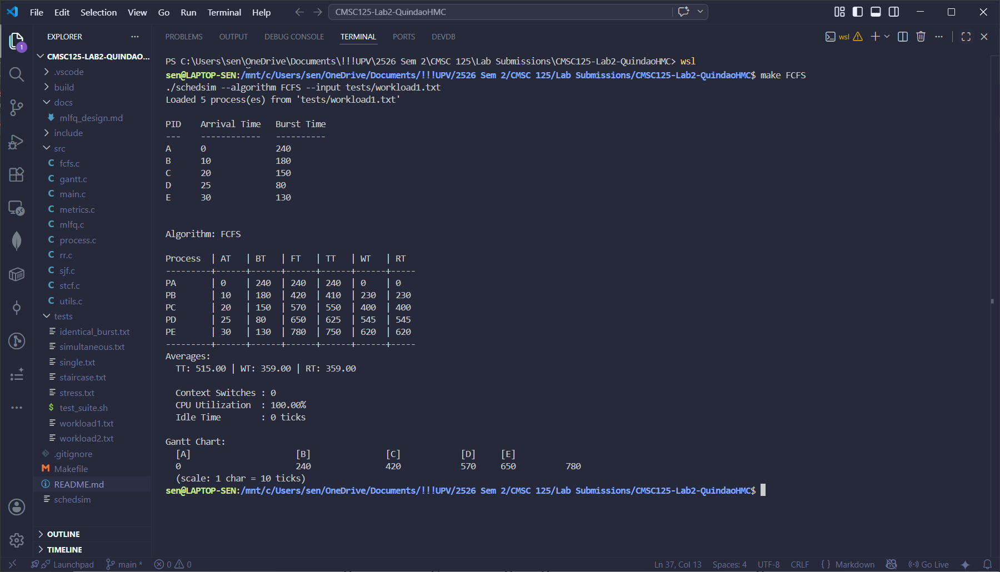
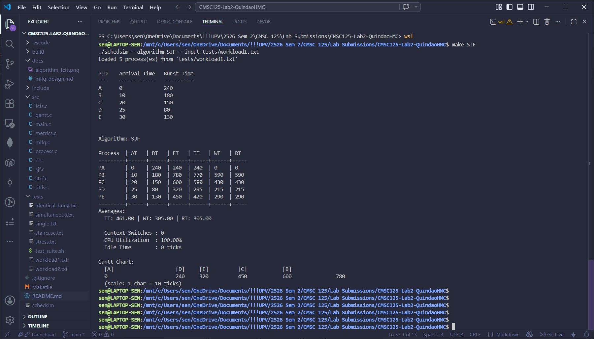
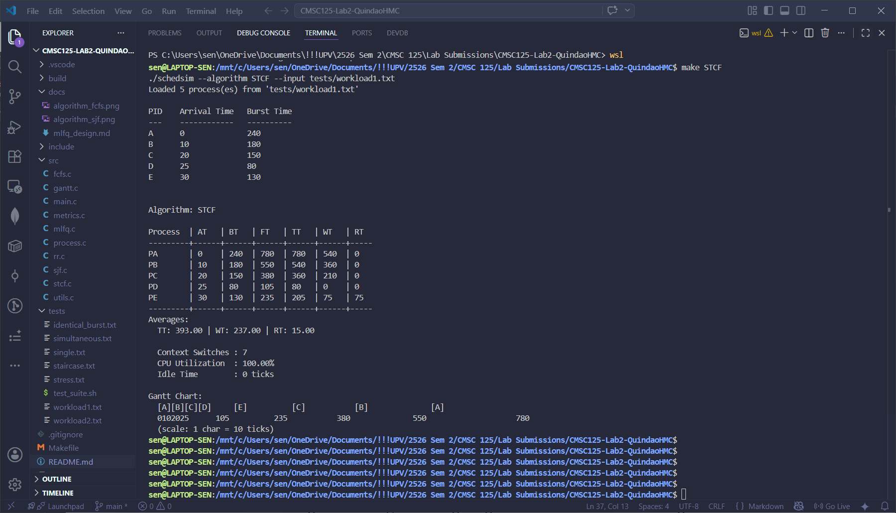
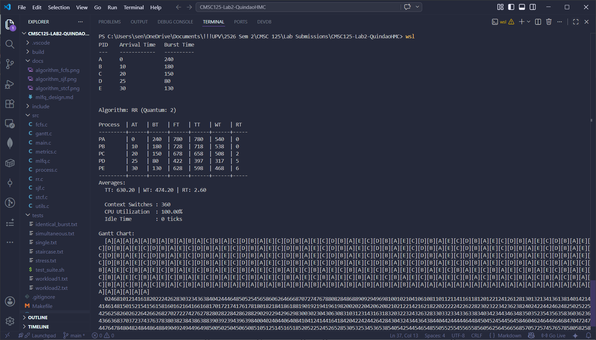
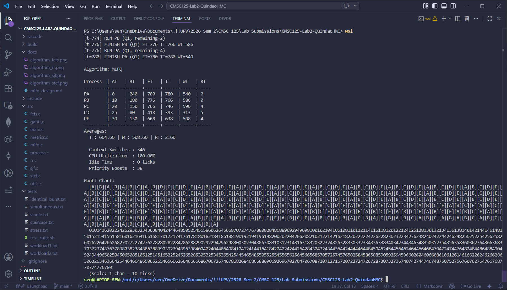
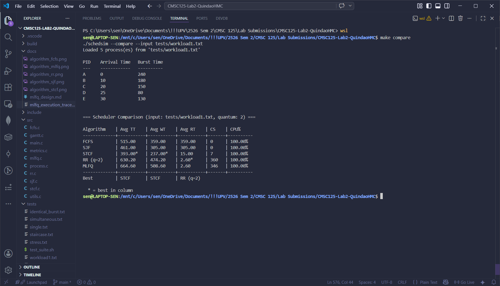
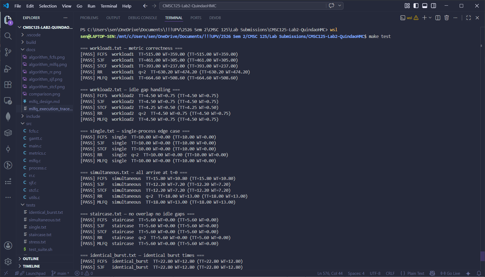
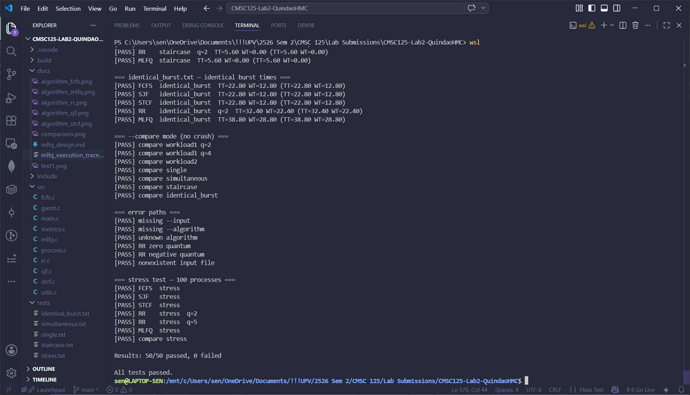

# CPU Scheduling
## CMSC 125-1 Lab-1 Laboratory 2 | Quindao, Hansen Maeve C.

A command-line CPU scheduling simulator written in C implementing FCFS, SJF, STCF, Round Robin, and Multi-Level Feedback Queue (MLFQ) algorithms with metrics reporting, Gantt visualization, and comparison mode.

## Features
* **5 Schedulers** (FCFS, SJF, STCF, RR, MLFQ)
* Gantt Chart Visualization
* Comparison Mode (Side-by-side performance analysis)
* Workload Parser (PID, Arrival Time, Burst Time)
* CPU Utilization Metrics (TT, WT, RT)
* Automated Test Suite with floating-point tolerance

---

## Installation

#### **1. Clone**
```bash
git clone [https://github.com/senqui-UP/CMSC125-Lab1-QuindaoHMC]
cd CMSC125-Lab1-QuindaoHMC
```

#### **Makefile**
A Makefile is provided. From the project root directory, run:
```bash
make            # compile schedsim
make clean      # remove object files and binary
make test       # to run automated test_suitr to verify algorithm correctness
```
To compare all of the schedulers to each other:
```bash
make compare
```

## Project Structure
CMSC125-Lab2-QuindaoHMC/
```
├── include/                # Header files (.h)             
│   ├── scheduler.h         # Scheduler interface definitions             
│   ├── process.h           # Process structures and constants             
│   └── gantt.h             # Gantt chart entry structures             
├── src/                    # Source files (.c)           
│   ├── main.c              # Entry point and command-line parsing           
│   ├── gantt.c             
│   ├── process.c          
│   ├── scheduler.c
│   ├── metrics.c
│   ├── utils.c
│   ├── rr.c                # Round Robin            
│   ├── mlfq.c              # MLFQ            
│   ├── fcfs.c              # First-Come First-Serve            
│   ├── sjf.c               # Shortest Job First            
│   └── stcf.c              # Shortest Time-to-Completion First            
├── tests/                  # Testing resources           
│   ├── test_suite.sh       # Automated Bash test script           
│   ├── workload1.txt       # Standard test workload           
│   ├── workload2.txt       # Idle gap test workload           
│   └── single.txt          # single process test           
│   └── simultaneous.txt    # all processes arrive same time test           
│   └── staircase.txt       # all process arrive exactly when last ends test           
│   └── identical_burst.txt # same burst test           
│   └── stress.txt          # 100-process stability test           
├── docs/                              
│   └── mlfq_design.md      # Detailed MLFQ logic and justification           
├── Makefile                # Build automation script           
└── README.md                          
```

## Command Line Options

| Flag | Description |
|---|---|
| `--algorithm <ALG>` | Scheduling algorithm to run (`FCFS`, `SJF`, `STCF`, `RR`, `MLFQ`) |
| `--input <file>` | Workload input file (**required**) |
| `--quantum <n>` | Time quantum for RR/MLFQ (default: `2`) |
| `--compare` | Run all algorithms and print comparison table |
| `--help`, `-h` | Show help message |

---

## MLFQ Design Decisions

The Multi-Level Feedback Queue (MLFQ) mimics real OS behavior by prioritizing interactive jobs without prior knowledge of burst times. To see more detail about the design, check  `docs/mlfq_design.md`

* **Three-Level Queueing**:
* **Q0**: High priority, 2-tick quantum, 4-tick allotment.
* **Q1**: Medium priority, 4-tick quantum, 8-tick allotment.
* **Q2**: Low priority, 8-tick quantum, infinite allotment.

* **Priority Boosting**: Every **20 ticks**, all processes are moved back to Q0 to prevent starvation of CPU-bound tasks.
* **Preemption**: Higher-priority queues (Q0/Q1) will immediately preempt a process running in a lower-priority queue.
* **Allotment Tracking**: Processes are demoted based on total CPU time used at a level (`time_in_queue`), not just single-quantum usage.

---

## Testing 

The simulator is verified using a Bash-based test suite that ensures mathematical accuracy within a **±0.05 tolerance** for floating-point averages.

**Current Test Coverage:**

* **Metric Correctness**: Validates Avg TT and WT for all algorithms against `workload1.txt`.
* **Idle Gap Handling**: Ensures the scheduler handles gaps in process arrival correctly (`workload2.txt`).
* **Edge Cases**: Includes single-process workloads, simultaneous arrivals at $T=0$, and identical burst-time tie-breaking.
* **Robustness**: Includes crash tests for 100+ process workloads and error-path validation for invalid inputs or negative quantums.

---

## Known Limitations

* **Static MLFQ Configuration**: While the design supports configurable levels, the current implementation uses hardcoded defaults (Boost=20, Q0=2, Q1=4, Q2=8).
* **Gantt Log Size**: The Gantt chart buffer is limited to `MAX_GANTT_ENTRIES`; very long-running simulations may drop trailing entries for visualization.
* **Context Switch Model**: Transitions from an IDLE state to a process are not counted as context switches.
* It is noted that there are plans to refactor the scheduler files so that a `sched_utils` is added to remove redundancy in gantt append helpers.

---

## Screenshots
### Per Algorithm






### Comparison


### Test_Suite

